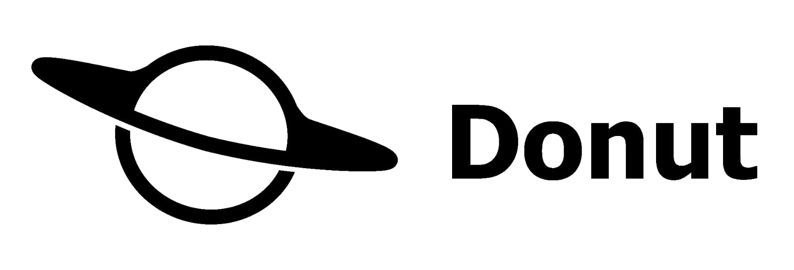
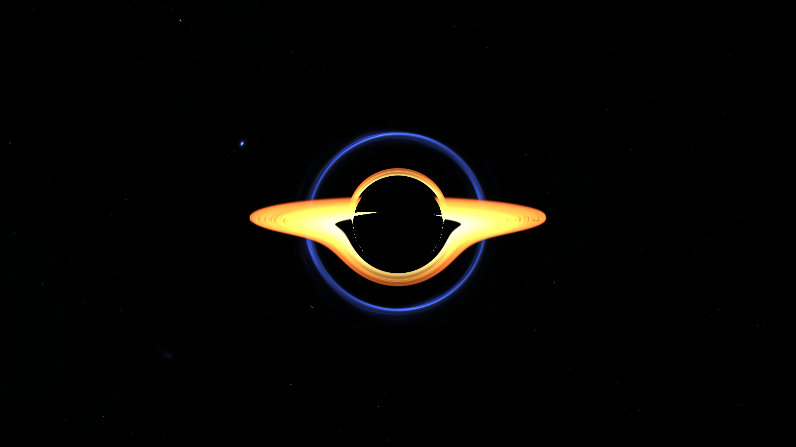
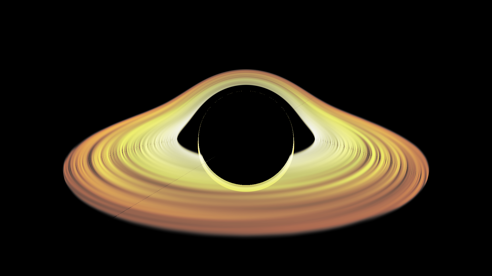

A real-time black hole ray tracer.

## Overview

Donut is a real-time black hole ray tracer that simulates the visual effects of gravitational lensing around Sagittarius A* (Sgr A*), the supermassive black hole at the center of our galaxy. The application renders images of how light would bend and distort as it passes near the black hole's intense gravitational field.

## Screenshots

*Real-time rendering of Sagittarius A* with volumetric accretion disk, featuring:*

- **Gravitational lensing** effects around the black hole
- **Volumetric cloud-like accretion disk** with realistic density variations
- **Dynamic rotation** with Keplerian orbital motion
- **Emission-based glow** with atmospheric scattering
- **High-quality 3D noise** for natural cloud patterns

## Key Features

- **Real-time Rendering**: GPU-accelerated compute shader implementation
- **Physically Accurate**: Based on General Relativity equations
- **Interactive Camera**: Orbital camera system with realistic constraints
- **Adaptive Performance**: Dynamic step size adjustment for optimal performance
- **Multiple Objects**: Support for rendering stars and other celestial bodies
- **Configurable Parameters**: Extensive settings for simulation and graphics
- **World Builder**: Interactive 3D scene editor with reference grid for spatial orientation

## System Requirements

- **GPU**: OpenGL 4.3+ compatible graphics card
- **Memory**: 4GB RAM minimum, 8GB recommended
- **Storage**: 100MB free space
- **OS**: Windows 10/11, Linux, macOS

For detailed information on each component, please refer to the specific documentation files in the `docs/` folder.
